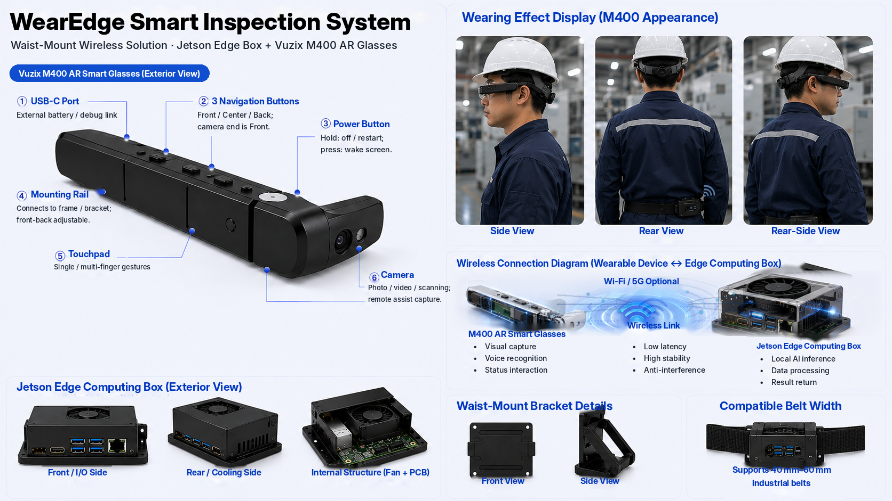

# WearEdge OPEA Manufacturing

Runnable OPEA-aligned manufacturing agent suite for WearEdge Pro.

Project URL:

```text
https://github.com/davidmillerak2026-sys/wearedge-opea-manufacturing
```

WearEdge OPEA Manufacturing is the OPEA-aligned delivery package for WearEdge Pro, a real industrial AI agent system for frontline manufacturing operations. A single Gateway and Manufacturing Megaservice route first-person M400 evidence, sanitized customer-production-derived quality evidence, and route-specific plant context through Dataprep, RAG, Vector DB, an optional OpenAI/OPEA-compatible LLM adapter, deterministic evaluators, and guardrails before producing bounded action cards for plant systems.

This is not a sample-only repository. The Web Console is the browser evaluation surface; the product released is a real five-agent industrial system packaged so operators and evaluators can run and inspect it without private plant data or M400 hardware.

WearEdge is model-flexible by design. The original WearEdge-Pro product path
has been validated on Jetson with a local Gemma 4 E2B VLM, which proves the
system is not a cloud-wrapper. This OPEA package also demonstrates that
the same five-agent manufacturing pipeline can connect to external production
LMM endpoints such as Gemini, or any OpenAI/OPEA-compatible vision endpoint,
through a strict adapter boundary. Local edge models serve privacy-sensitive
and offline factory deployments; external model APIs serve cloud-augmented
visual reasoning and enterprise model-service replacement.

The OPEA value is the modular system boundary, not any single model choice:
Gateway, Manufacturing Megaservice, Retriever/RAG, Vector DB, LLM adapter,
Evaluator, and Guardrails are independent and composable. The model is a
pluggable component behind the adapter, while the manufacturing route logic,
source grounding, deterministic checks, human-confirmation gates, and action
card contracts remain stable.

Project highlights:

```text
Five manufacturing agents + official OPEA TEI embeddings + Qdrant RAG +
modular Gateway/Megaservice/Retriever/Vector DB/LLM adapter/Evaluator/Guardrails +
GenAIEval-compatible evidence + GCP C3 evidence.
```

Complete OPEA demo video:

[](https://youtu.be/ID8QPYhhhtk)

[Watch the complete OPEA demo video on YouTube](https://youtu.be/ID8QPYhhhtk)

Single-node runtime profile:

```text
Google Cloud C3 c3-standard-4
4 vCPU, 16 GiB RAM, no GPU
Intel Xeon Platinum 8481C with AVX-512 and AMX flags detected
Within the target runtime limit: single node, <=64GB RAM, 4-core CPU profile, GPU optional
Strict 10-minute path: default Docker/Qdrant profile passed clean_initial_run_under_10_min=true on GCP C3 timed run wearedge-docker-e2e-0529041313
Measured clean install + initial run: 45 seconds
```

## Product Package

This repository is the public product package. It is not released as an Android-only app. The runnable package is a Docker-runnable OPEA Manufacturing Agent Suite with a browser manufacturing console, public API, five sample routes, and scorecard.

Product front ends:

| Front end | Role |
| --- | --- |
| Browser Manufacturing Console at `/demo` | Evaluation-facing experience for reproducible evaluation |
| API endpoints under `/v1` | Machine-verifiable OPEA route and scorecard surface |
| Vuzix M400 / Android client | Real deployment front end and field-evidence source from the full WearEdge-Pro project |

The M400 evidence is a product differentiator, but evaluators do not need M400 hardware to run the project.

Physical deployment reference:



This reference image shows the WearEdge waist-mount wireless setup with Vuzix M400 AR glasses, Jetson edge computing box, wireless link, bracket details, and industrial belt mounting. It illustrates the broader WearEdge field deployment shape; the OPEA evaluation package remains runnable through Docker, Web, and API without requiring the hardware.

## OPEA Architecture Fit

WearEdge Pro maps cleanly to OPEA enterprise application requirements:

| OPEA requirement | WearEdge answer |
| --- | --- |
| Domain-specific GenAI application | Manufacturing AI agent suite using OPEA-style Gateway, Megaservice, LLM adapter, TEI embeddings, Qdrant RAG, guardrails, and evaluation |
| Concrete industry scenario | Manufacturing, with maintenance, IQC, changeover, work-instruction, and hazard workflows |
| Working prototype with documentation | Docker-runnable OPEA package, README, technical report, `deploy.sh`, Compose profiles, and one-command smoke path |
| Performance and usability | GCP C3 4-vCPU / 16-GiB / no-GPU evidence, latency JSON, Docker memory stats, 8-worker route concurrency benchmark, 300-call GenAIEval-compatible benchmark, and `/demo` browser console |

See [`docs/opea-architecture-alignment.md`](docs/opea-architecture-alignment.md).

## Five Manufacturing Agents

| Mode | Scenario | Integration target | Business value |
| --- | --- | --- | --- |
| `maintenance` | Lao-shi-fu predictive maintenance for `PKG-L3-GBX-03` | `maintenance_work_order` | Reduce downtime and preserve expert troubleshooting patterns |
| `iqc` | IQC/OQC quality inspection, with private customer lineage including toothbrush workshop visual inspection | `qms_quality_event` | Reduce scrap, rework, and customer escape risk |
| `changeover` | Labeler SKU-C500 changeover verification | `changeover_checklist` | Reduce restart errors, mix-up risk, and changeover loss |
| `wi` | Released work-instruction guidance for `CARTONER-ST2` | `wi_reference` | Reduce training time and procedure drift |
| `hazard` | PPE, moving-parts, and blocked-walkway EHS observation | `ehs_case` | Improve near-miss capture and corrective action routing |

The maintenance route remains the hero route because it has the strongest archived M400/Jetson field evidence, but all five agents are runnable through the same OPEA-style API.

## OPEA Architecture

```text
Vuzix M400 / API request
  -> Gateway
  -> Manufacturing Megaservice
  -> route registry: maintenance / iqc / changeover / wi / hazard
  -> Dataprep + route-specific knowledge source
  -> Retriever / RAG
  -> Qdrant Vector DB profile, with in-memory fallback
  -> optional OPEA-compatible Embedding Microservice /v1/embeddings
  -> LLM service adapter, deterministic no-model evaluation path or OpenAI/OPEA-compatible endpoint
  -> route-specific evaluator
  -> Guardrails and blocked claims
  -> CMMS / QMS / MES / WI / EHS action card
  -> scorecard and GenAIEval-compatible evidence artifacts
```

Official component evidence is in [`evidence/component-evidence.json`](evidence/component-evidence.json) and [`docs/opea-component-evidence.md`](docs/opea-component-evidence.md).

## Run Locally

Dependency-free local runtime:

```powershell
.\scripts\run_demo.ps1
```

Code validation:

```powershell
$env:PYTHONPATH="src"
python -m unittest discover -s tests
```

Docker Compose profile with Qdrant:

```bash
docker compose up --build -d
# Open in browser: http://127.0.0.1:8088/demo
curl http://127.0.0.1:8088/healthz
curl http://127.0.0.1:8088/v1/agents
curl http://127.0.0.1:8088/v1/agents/maintenance/demo
curl http://127.0.0.1:8088/v1/agents/iqc/demo
curl http://127.0.0.1:8088/v1/agents/changeover/demo
curl http://127.0.0.1:8088/v1/agents/wi/demo
curl http://127.0.0.1:8088/v1/agents/hazard/demo
curl http://127.0.0.1:8088/v1/scorecard
```

Official OPEA-compatible embedding microservice profile:

```bash
docker compose -f docker-compose.yml -f docker-compose.opea.yml up --build -d
curl http://127.0.0.1:6000/healthz
curl http://127.0.0.1:8088/healthz
curl http://127.0.0.1:8088/v1/agents/maintenance/demo
curl http://127.0.0.1:8088/v1/scorecard
```

This profile routes Qdrant embeddings through a separate `/v1/embeddings`
microservice and reports `qdrant-opea-compatible-embedding-vector-store` in
RAG results.

Official OPEA TEI embedding profile:

```bash
docker compose -f docker-compose.yml -f docker-compose.opea-tei.yml up -d
curl http://127.0.0.1:6000/v1/health_check
curl http://127.0.0.1:8088/healthz
curl http://127.0.0.1:8088/v1/agents/maintenance/demo
curl http://127.0.0.1:8088/v1/scorecard
```

This profile follows the OPEA GenAIComps TEI pattern: Hugging Face TEI serves
the embedding model, the OPEA embedding microservice connects through
`TEI_EMBEDDING_ENDPOINT` and
`EMBEDDING_COMPONENT_NAME=OPEA_TEI_EMBEDDING`, and the Manufacturing Gateway
uses `/v1/embeddings` for Qdrant indexing and retrieval.

Optional OPEA-compatible reranker profile:

```bash
docker compose -f docker-compose.yml -f docker-compose.reranker.yml up --build -d
curl http://127.0.0.1:7000/healthz
curl http://127.0.0.1:8088/v1/agents/maintenance/demo
curl http://127.0.0.1:8088/v1/scorecard
```

This profile inserts a separate `/v1/rerank` microservice after vector
retrieval and before route evaluation. See
[`docs/opea-reranker-profile.md`](docs/opea-reranker-profile.md).

Optional Kubernetes profile:

```powershell
docker build -t wearedge-opea-manufacturing:local .
kubectl apply -f deploy\kubernetes\wearedge-opea-manufacturing.yaml
```

See [`docs/kubernetes-optional-profile.md`](docs/kubernetes-optional-profile.md).

LLM adapter contract benchmark:

```powershell
$env:PYTHONPATH="src"
python scripts\llm_adapter_benchmark.py --iterations 1 `
  --output evidence\benchmarks\llm_adapter_contract.local-smoke.json
```

To benchmark a real OpenAI/OPEA-compatible LLM endpoint, set
`WEAREDGE_LLM_BACKEND=openai-compatible`, `WEAREDGE_LLM_URL` or
`WEAREDGE_LLM_BASE_URL`, `WEAREDGE_LLM_MODEL`, and
`WEAREDGE_LLM_STRICT=true`. See
[`docs/production-llm-benchmark-path.md`](docs/production-llm-benchmark-path.md).

Local Gemma models can also be used if they are served as a real endpoint. For
example, with Ollama:

```powershell
$env:PYTHONPATH="src"
python scripts\llm_adapter_benchmark.py --local-profile ollama `
  --model <your-gemma-model-name> `
  --strict --iterations 1 `
  --output evidence\benchmarks\llm_adapter.local-gemma.json
```

Use local LLM evidence only when the benchmark reports
`claim_status=local_llm_endpoint_benchmarked`, `fallback_count=0`, and
`all_contracts_pass=true`. See
[`docs/local-gemma-llm-benchmark.md`](docs/local-gemma-llm-benchmark.md).
The current evidence includes a strict WSL/Ollama `gemma4:31b` run in
`evidence/benchmarks/llm_adapter.local-gemma.json`.

Strict LMM oil-leak image benchmark:

```powershell
$env:PYTHONPATH="src"
$env:WEAREDGE_LMM_PROVIDER="gemini"
$env:GEMINI_MODEL="gemini-2.5-flash"
python scripts\lmm_image_benchmark.py --image evidence\images\machine_oil_leak.png `
  --output evidence\benchmarks\lmm_machine_oil_leak.strict.json --strict
```

Only cite this as production LMM evidence when the output reports
`claim_status=strict_production_lmm_endpoint_benchmarked` and
`all_checks_pass=true`. See
[`docs/lmm-machine-oil-leak-benchmark-report.md`](docs/lmm-machine-oil-leak-benchmark-report.md).

This benchmark is intentionally described as an external model-adapter pass:
it complements the source WearEdge-Pro Jetson/Gemma 4 E2B evidence, but does
not replace the local VLM product path.

GenAIEval-compatible route evaluation:

```powershell
$env:PYTHONPATH="src"
python evals\genaieval\run_wear_edge_eval.py --output evidence\genaieval\route_eval_results.json --summary-output evidence\genaieval\summary.md
python evals\genaieval\run_wear_edge_benchmark.py --iterations 20 --output evidence\genaieval\benchmark_results.json
```

This lightweight package provides a JSONL dataset, benchmark metadata, runner,
metrics, and committed evidence outputs. It does not claim full official
GenAIEval/RAGAS/AutoRAG/LLM-as-evaluator execution.

Official GenAIEval benchmark:

```powershell
.\scripts\run_official_genaieval_benchmark.ps1
```

This uses `evals/genaieval/official_wearedge_benchmark.yaml`, the
`/v1/chatqna` SSE compatibility alias, and records the latest local official
run summary in `evidence/genaieval/official_benchmark_summary.json`. See
[`docs/official-genaieval-benchmark.md`](docs/official-genaieval-benchmark.md).

The legacy maintenance endpoints remain available:

```bash
curl http://127.0.0.1:8088/v1/manufacturing/demo
curl http://127.0.0.1:8088/v1/manufacturing/suite
```

## API Surface

| Endpoint | Purpose |
| --- | --- |
| `GET /` and `GET /demo` | Browser Manufacturing Console |
| `GET /healthz` | Service, vector backend, and supported agents |
| `GET /v1/agents` | Route registry and knowledge/sample paths |
| `GET /v1/agents/{mode}/demo` | Fixed sample request for one agent |
| `POST /v1/agents/{mode}/infer` | Route-specific inference with caller-provided evidence |
| `GET /v1/scorecard` | Five-route scorecard: latency, contract, guardrail, RAG/source match, action target correctness |

## Included Materials

| Path | Purpose |
| --- | --- |
| [`PROJECT_OVERVIEW.md`](PROJECT_OVERVIEW.md) | Project overview |
| [`TECHNICAL_REPORT.md`](TECHNICAL_REPORT.md) | <=2 page technical report |
| [`docs/technical-report-working-copy.md`](docs/technical-report-working-copy.md) | Source working copy retained for traceability |
| [`docs/product-package.md`](docs/product-package.md) | Final product/deliverable definition |
| [`docs/release-readiness-audit.md`](docs/release-readiness-audit.md) | Evaluation criteria mapping, evidence links, and remaining final tasks |
| [`docs/project-profile-fill-guide.md`](docs/project-profile-fill-guide.md) | Copy/paste guide for the public project profile |
| [`docs/product-evaluation-map.md`](docs/product-evaluation-map.md) | 100 base + 40 evidence product evidence areas product-hardening audit |
| [`docs/product-hardening-plan.md`](docs/product-hardening-plan.md) | Point-by-point follow-up plan for OPEA, LLM, code quality, UI, and evidence gaps |
| [`docs/local-ui-product-hardening-follow-up-validation.md`](docs/local-ui-product-hardening-follow-up-validation.md) | Local Docker/UI validation after the product hardening follow-up changes |
| [`docs/opea-architecture-alignment.md`](docs/opea-architecture-alignment.md) | Direct mapping to the official OPEA architecture requirements |
| [`docs/release-guidelines-audit.md`](docs/release-guidelines-audit.md) | Final audit against release format, hardware/runtime, licensing, and originality rules |
| [`docs/hardware-constraints-and-clean-run.md`](docs/hardware-constraints-and-clean-run.md) | Hardware constraint mapping and 10-minute clean-run claim boundary |
| [`docs/license-and-attribution.md`](docs/license-and-attribution.md) | Open-source license, third-party attribution, and restrictive-license boundary |
| [`docs/source-vlm-e2e-evidence-map.md`](docs/source-vlm-e2e-evidence-map.md) | WearEdge-Pro real Jetson/Gemma 4 E2B VLM E2E evidence map and OPEA repo boundary |
| [`docs/lmm-machine-oil-leak-benchmark-report.md`](docs/lmm-machine-oil-leak-benchmark-report.md) | Strict public oil-leak image benchmark protocol for real LMM endpoints |
| [`docs/release-evidence-audit-2026-05-28.md`](docs/release-evidence-audit-2026-05-28.md) | Final release evidence audit |
| [`docs/product-risk-burn-down.md`](docs/product-risk-burn-down.md) | One-by-one mitigation for the six known product risks |
| [`docs/opea-native-depth-matrix.md`](docs/opea-native-depth-matrix.md) | OPEA component depth matrix and claim boundaries |
| [`docs/production-llm-benchmark-path.md`](docs/production-llm-benchmark-path.md) | Optional production LLM endpoint benchmark path |
| [`docs/local-gemma-llm-benchmark.md`](docs/local-gemma-llm-benchmark.md) | Local Gemma/Ollama/LM Studio/vLLM/llama.cpp strict LLM benchmark path |
| [`docs/genaieval-compatible-evaluation.md`](docs/genaieval-compatible-evaluation.md) | Lightweight GenAIEval-compatible dataset, runner, metrics, and evidence |
| [`docs/official-genaieval-benchmark.md`](docs/official-genaieval-benchmark.md) | Official OPEA GenAIEval benchmark YAML and run script path |
| [`docs/opea-reranker-profile.md`](docs/opea-reranker-profile.md) | Optional OPEA-compatible reranker service profile |
| [`docs/kubernetes-optional-profile.md`](docs/kubernetes-optional-profile.md) | Optional Kubernetes deployment manifest and claim boundary |
| [`docs/data-provenance-and-field-validation.md`](docs/data-provenance-and-field-validation.md) | Real system lineage, public data scope, and field validation boundary |
| [`docs/telecom-scope-and-manufacturing-positioning.md`](docs/telecom-scope-and-manufacturing-positioning.md) | Manufacturing positioning if evaluators compare telecom/network projects |
| [`docs/public-url-check.md`](docs/public-url-check.md) | Public URL availability check for project profile fields |
| [`docs/local-docker-desktop-final-validation.md`](docs/local-docker-desktop-final-validation.md) | Final local Docker Desktop runtime validation |
| [`docs/official-opea-profile.md`](docs/official-opea-profile.md) | OPEA-compatible embedding microservice profile |
| [`docs/official-opea-tei-profile.md`](docs/official-opea-tei-profile.md) | Official OPEA TEI embedding profile and C3 rerun instructions |
| [`docs/publication-record.md`](docs/publication-record.md) | Public OPEA/article publication URLs |
| [`docs/opea-upstream/`](docs/opea-upstream/) | OPEA RFC issue working copy, blueprint feedback, and PR plan |
| [`docs/opea-upstream/pr-ready/`](docs/opea-upstream/pr-ready/) | Copyable OPEA `GenAIExamples` contribution package |
| [`docs/upstream-pr-attempt-2026-05-28.md`](docs/upstream-pr-attempt-2026-05-28.md) | Direct upstream PR attempt, fork push, opened PR record, and current check-status boundary |
| [`docs/intel-avx512-amx-benchmark-report.md`](docs/intel-avx512-amx-benchmark-report.md) | Intel CPU benchmark report with Google Cloud C3 Xeon AVX-512/AMX evidence |
| [`docs/intel-effective-use-evidence.md`](docs/intel-effective-use-evidence.md) | Intel effective-use evidence across route, Qdrant, embedding, and official OPEA TEI workloads |
| [`docs/gcp-c3-docker-qdrant-e2e-report.md`](docs/gcp-c3-docker-qdrant-e2e-report.md) | Google Cloud C3 fresh-clone Docker/Qdrant E2E evidence |
| [`docs/gcp-c3-opea-profile-e2e-report.md`](docs/gcp-c3-opea-profile-e2e-report.md) | Google Cloud C3 OPEA-compatible embedding profile E2E evidence |
| [`docs/local-opea-tei-profile-e2e-report.md`](docs/local-opea-tei-profile-e2e-report.md) | Local official OPEA TEI embedding profile E2E evidence |
| [`docs/gcp-c3-opea-tei-profile-e2e-report.md`](docs/gcp-c3-opea-tei-profile-e2e-report.md) | Google Cloud C3 official OPEA TEI embedding profile E2E evidence |
| [`docs/gcp-c3-tei-onednn-verbose-runbook.md`](docs/gcp-c3-tei-onednn-verbose-runbook.md) | GCP C3 TEI oneDNN/ISA verbose capture runbook |
| [`docs/gcp-c3-tei-onednn-verbose-report.md`](docs/gcp-c3-tei-onednn-verbose-report.md) | Captured C3 TEI/oneDNN verbose attempt result and claim boundary |
| [Dev.to external article](https://dev.to/ryan_hsu_wearedge/wearedge-pro-an-opea-manufacturing-five-agent-suite-for-frontline-operators-5afh) | Published public knowledge-sharing article |
| [OPEA docs Publications PR](https://github.com/opea-project/docs/pull/395) | OPEA Publications / Blogs listing proposal; open and not merged yet |
| [`public/article-wear-edge-opea-manufacturing.md`](public/article-wear-edge-opea-manufacturing.md) | Public GitHub article backup |
| [`public/article-opea-tei-qdrant-guardrails-lessons.md`](public/article-opea-tei-qdrant-guardrails-lessons.md) | OPEA practical technical article: TEI, Qdrant, guardrails, hardware, and feedback |
| [`public/external-platform-article.md`](public/external-platform-article.md) | Source article package published via Dev.to |
| [`docs/public-platform-publishing-handoff.md`](docs/public-platform-publishing-handoff.md) | Public article/video/OPEA Publications PR links and claim boundary |
| [`public/product-walkthrough-script.md`](public/product-walkthrough-script.md) | 1-3 minute product walkthrough video shot list and narration |
| [`public/video-platform-description.md`](public/video-platform-description.md) | Ready-to-use public video platform title, description, and tags |
| [Complete OPEA demo video](https://youtu.be/ID8QPYhhhtk) | Full public demo video for evaluator review |
| [`public/images/wearedge-pro-complete-opea-demo-cover.png`](public/images/wearedge-pro-complete-opea-demo-cover.png) | Clickable README cover image for the complete OPEA demo video |
| [YouTube product walkthrough video](https://www.youtube.com/watch?v=dd9k8m6PDco) | Published public product walkthrough video |
| [`public/product-walkthrough/`](public/product-walkthrough/) | Renderable HyperFrames product walkthrough video source package |
| [`docs/product-walkthrough-render-report.md`](docs/product-walkthrough-render-report.md) | Local product walkthrough render and validation evidence |
| [`public/images/wearedge-smart-inspection-waist-mount.png`](public/images/wearedge-smart-inspection-waist-mount.png) | Physical WearEdge M400 + Jetson waist-mount deployment reference image |
| [`evals/genaieval/`](evals/genaieval/) | GenAIEval-compatible evaluation pack |
| [`evidence/genaieval/`](evidence/genaieval/) | Generated route evaluation, benchmark JSON, and summary |
| [`evidence/source-wearedge-vlm/e2e-summary.json`](evidence/source-wearedge-vlm/e2e-summary.json) | Machine-readable source-project VLM evidence summary |
| [`evidence/images/machine_oil_leak.png`](evidence/images/machine_oil_leak.png) | Public redacted maintenance image fixture for strict LMM benchmark |
| [`data/sample_requests/`](data/sample_requests/) | Five agent sample inputs |
| [`data/agent_kb/`](data/agent_kb/) | IQC, changeover, WI, and hazard knowledge sources |
| [`data/maintenance_kb/`](data/maintenance_kb/) | Lao-shi-fu maintenance KB |
| [`src/wear_edge_opea/agents.py`](src/wear_edge_opea/agents.py) | Unified route registry |
| [`src/wear_edge_opea/demo_console.py`](src/wear_edge_opea/demo_console.py) | Evaluation-facing browser product console |
| [`src/wear_edge_opea/llm_adapter.py`](src/wear_edge_opea/llm_adapter.py) | Deterministic and OpenAI/OPEA-compatible LLM adapter |
| [`src/wear_edge_opea/scorecard.py`](src/wear_edge_opea/scorecard.py) | Five-agent evaluation scorecard |
| [`docker-compose.yml`](docker-compose.yml) | Qdrant + Manufacturing Gateway runnable profile |
| [`docker-compose.opea.yml`](docker-compose.opea.yml) | Optional OPEA-compatible embedding microservice override |
| [`docker-compose.opea-tei.yml`](docker-compose.opea-tei.yml) | Optional official OPEA TEI embedding profile |
| [`tests/`](tests/) | Route, guardrail, scorecard, and Qdrant validation |

## Project Profile Fields

Project profile fields are in [`project-profile.json`](project-profile.json).

Recommended component selection:

```text
LLM, RAG, Vector DB, Orchestration, Guardrails, Embeddings, Evaluation, Retriever, Reranker
```

## Evidence Check

```powershell
python scripts\evidence_check.py
```

Expected:

```text
OPEA project evidence check passed
```

## License And Third-Party Attribution

This repository is licensed under the MIT License. The root [`LICENSE`](LICENSE)
file is authoritative for original WearEdge OPEA Manufacturing source code, and
source files include SPDX headers.

Declared third-party components:

| Component | License | Purpose |
| --- | --- | --- |
| Python standard library | PSF License | Dependency-free local sample, evaluation, and evidence tooling |
| FastAPI | MIT | Optional HTTP Gateway and embedding microservice API |
| Uvicorn | BSD-3-Clause | Optional ASGI server for FastAPI services |
| Qdrant `qdrant/qdrant:v1.12.6` | Apache-2.0 | Optional Vector DB profile for RAG evidence |
| OPEA `opea/embedding:latest` | Apache-2.0 project family | Optional official OPEA TEI embedding profile |
| Hugging Face Text Embeddings Inference | Apache-2.0 | Optional TEI embedding model server |
| BAAI `bge-base-en-v1.5` | MIT model family notice | Optional TEI embedding model for 768-dimensional evidence |
| External OpenAI/OPEA-compatible or Gemini-compatible model endpoint | Provider terms selected by deployer | Optional LLM/LMM adapter benchmark; not bundled or required by default |

No GPL, LGPL, AGPL, or other restrictive-license package is intentionally
imported, vendored, or required by the default application source. See
[`docs/license-and-attribution.md`](docs/license-and-attribution.md) for the
full attribution boundary.

## Evidence

OPEA open-source contribution package:

```text
https://github.com/opea-project/GenAIExamples/issues/2461
https://github.com/opea-project/GenAIExamples/pull/2462
https://github.com/opea-project/docs/pull/395
https://github.com/davidmillerak2026-sys/wearedge-opea-manufacturing/issues/2
https://github.com/opea-project/GenAIExamples/issues/2461#issuecomment-4554039017
docs/upstream-pr-attempt-2026-05-28.md
docs/opea-upstream/rfc-issue-working-copy.md
docs/opea-upstream/blueprint-feedback.md
docs/opea-upstream/implementation-feedback-comment.md
docs/opea-upstream/minimal-pr-scope.md
docs/opea-upstream/pr-ready-update-comment.md
docs/opea-upstream/pr-ready/
docs/opea-upstream/pr-ready/0001-add-manufacturing-agent-suite.patch
```

Knowledge-sharing package:

```text
https://dev.to/ryan_hsu_wearedge/wearedge-pro-an-opea-manufacturing-five-agent-suite-for-frontline-operators-5afh
https://www.youtube.com/watch?v=dd9k8m6PDco
https://github.com/opea-project/docs/pull/395
https://github.com/davidmillerak2026-sys/wearedge-opea-manufacturing/issues/1
public/article-wear-edge-opea-manufacturing.md
public/external-platform-article.md
docs/public-platform-publishing-handoff.md
public/product-walkthrough-script.md
public/product-walkthrough-captions.srt
public/video-platform-description.md
public/product-walkthrough/
docs/product-walkthrough-render-report.md
https://www.youtube.com/watch?v=dd9k8m6PDco
```

Intel CPU benchmark evidence:

```powershell
$env:PYTHONPATH="src"
python scripts\intel_cpu_benchmark.py --iterations 200
```

The committed benchmark evidence includes:

```text
evidence/benchmarks/intel_cpu_benchmark.local-smoke.json
evidence/benchmarks/intel_cpu_benchmark.xeon-amx.json
evidence/benchmarks/intel_effective_use.summary.json
evidence/benchmarks/gcp_c3_docker_qdrant_e2e.summary.json
evidence/benchmarks/gcp_c3_docker_qdrant_e2e_timed.summary.json
evidence/benchmarks/local_opea_profile_e2e.summary.json
evidence/benchmarks/local_opea_tei_profile_e2e.summary.json
evidence/benchmarks/gcp_c3_opea_profile_e2e.summary.json
evidence/benchmarks/gcp_c3_opea_tei_profile_e2e.summary.json
evidence/benchmarks/gcp_c3_tei_onednn_verbose.summary.json
evidence/benchmarks/llm_adapter_contract.local-smoke.json
evidence/benchmarks/route_concurrency.local-smoke.json
```

Official OPEA TEI rerun script:

```text
scripts/gcp_c3_opea_tei_profile_e2e_cloudshell.sh
```

GenAIEval-compatible evidence:

```text
evals/genaieval/manufacturing_route_eval.dataset.jsonl
evals/genaieval/manufacturing_route_benchmark.yaml
evidence/genaieval/route_eval_results.json
evidence/genaieval/benchmark_results.json
evidence/genaieval/summary.md
```

The committed route evaluation reports 15/15 cases passing across maintenance,
IQC, changeover, WI, and hazard. The benchmark records 300 route evaluations
with all cases passing and all five routes covered.

The Xeon run was captured on Google Cloud C3 `c3-standard-4`, a single-node
4-vCPU / 16-GiB-RAM / no-GPU profile that is inside the target runtime limit of
single node, <=64GB RAM, and 4-core CPU. The CPU was Intel Xeon Platinum 8481C
with `avx512f=true`, `amx_tile=true`, `amx_int8=true`, `amx_bf16=true`,
scorecard `ok=true`, and 4,581.4536 calls/second across 5,000 deterministic
route calls.

The Intel effective-use summary combines that CPU feature run with C3
Docker/Qdrant E2E, OPEA-compatible embedding E2E, and official OPEA TEI E2E.
It shows the WearEdge OPEA TEI embedding/RAG profile and five-agent suite
running inside the single-node 4-vCPU / 16-GiB-RAM / no-GPU target runtime envelope.
It does not claim TEI-internal oneDNN microkernel dispatch proof or production
LLM acceleration. The supplemental r23 evidence does include same-host oneDNN
BF16/AMX probe dispatch markers.

The Docker/Qdrant E2E run was captured on Google Cloud C3 `c3-standard-4` in `us-central1-a`. It fresh-cloned this repository, started Docker Compose, verified Qdrant plus the Manufacturing Gateway, passed all five sample and infer routes, passed `/v1/scorecard`, and deleted the temporary VM `wearedge-docker-e2e-0527082214` after the run.

The timed Docker/Qdrant clean-run was captured on Google Cloud C3
`c3-standard-4` in `us-central1-a` on temporary VM
`wearedge-docker-e2e-0529041313`. The default `docker-compose.yml` profile
passed `/demo`, `/healthz`, five sample routes, five infer routes,
`/v1/scorecard`, Docker stats capture, `clean_initial_run_under_10_min=true`,
and `all_checks_pass=true`, then deleted the VM after the run. The measured
clean installation and initial-run time was 45 seconds, with `setup_seconds=23`.

The official OPEA TEI E2E run was captured on Google Cloud C3 `c3-standard-4` in `us-central1-a`. It fresh-cloned this repository, started Qdrant, `opea/embedding:latest`, Hugging Face TEI, and the Manufacturing Gateway, verified 768-dimensional TEI embeddings, passed all five sample routes with `qdrant-opea-tei-vector-store`, passed `/v1/scorecard`, and deleted the temporary VM `wearedge-opea-tei-0527103938` after the run.

The supplemental TEI/oneDNN run was captured on Google Cloud C3
`c3-standard-4` in `us-central1-a` from the historical May 29 submission
series, now represented by the valid `final-submission-2026-05-29-r23` tag.
It started the same official OPEA TEI
profile plus verbose env capture, passed Gateway health, `/v1/scorecard`, all
five sample routes, Docker stats capture, AVX-512 flag check, AMX flag check, TEI
log capture, and a same-host oneDNN BF16/AMX probe, then deleted temporary VM
`wearedge-tei-onednn-0529024359`. The captured TEI build did not emit oneDNN
dispatch marker lines, but the same-host probe did capture oneDNN BF16/AMX
dispatch markers. This is application-level Intel C3 effective-use evidence
plus host-level oneDNN dispatch evidence, not TEI-internal AMX dispatch proof.

Xeon AMX runbook:

```text
docs/xeon-amx-benchmark-runbook.md
scripts/xeon_amx_benchmark_remote.sh
```

## Source Provenance

This repository is the self-contained OPEA product package. The full engineering project remains available at:

```text
https://github.com/davidmillerak2026-sys/WearEdge-Pro
```

The released system is an assistive industrial AI decision-support system, not a certified safety or maintenance-release controller. High-risk outputs remain human-confirmed, and guardrails block unsupported claims such as final root cause, restart permission, quality release, safety clearance, and maintenance release.
