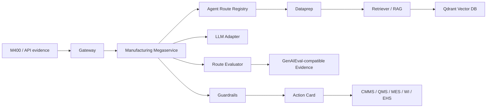

# OPEA Component Evidence

This document maps WearEdge Pro's five Manufacturing agents to the OPEA architecture expected by the OPEA evaluators.

The evaluation-facing product entry point is the browser Manufacturing Console:

```text
http://127.0.0.1:8088/demo
```

The M400 Android client is the real deployment front end and field-evidence source; the Web Console is the reproducible evaluation surface in this OPEA package. Private customer production-data lineage exists outside this public repository, including quality-inspection work such as toothbrush workshop visual inspection for IQC/OQC-style defect detection.

## Official OPEA References

| Reference | URL | How this project uses it |
| --- | --- | --- |
| OPEA overview | https://opea-project.github.io/latest/introduction/index.html | Gateway, microservice, and megaservice architecture alignment |
| GenAI microservices | https://opea-project.github.io/latest/microservices/index.html | Microservice categories for LLM, RAG, guardrails, and orchestration |
| GenAIComps | https://github.com/opea-project/GenAIComps | Composable component reference |
| GenAIExamples | https://github.com/opea-project/GenAIExamples | Example application and deployment reference |
| GenAIEval | https://github.com/opea-project/GenAIEval | Compatibility boundary for dataset, runner, metrics, benchmark evidence, and pass/fail summary |

## Architecture



## Five-Agent Coverage

| Mode | Knowledge source | Evaluator | Guarded target |
| --- | --- | --- | --- |
| `maintenance` | Gearbox KB and thresholds | vibration, temperature, lubrication, PLC alarm | `maintenance_work_order` |
| `iqc` | Sanitized quality plan, backed by private IQC/OQC production-data lineage | detector confidence and defect severity | `qms_quality_event` |
| `changeover` | SKU-C500 changeover checklist | line clearance, label, recipe, first-piece | `changeover_checklist` |
| `wi` | Cartoner released work instruction | identity, released revision, guard, alarm | `wi_reference` |
| `hazard` | PPE, moving-parts, walkway policy | active hazard flags | `ehs_case` |

## Evidence Table

| OPEA layer | Status | WearEdge evidence | Claim |
| --- | --- | --- | --- |
| Gateway | Implemented | `src/wear_edge_opea/gateway.py`, `Dockerfile`, `docker-compose.yml` | Five-agent FastAPI entry point |
| Browser Manufacturing Console | Implemented | `src/wear_edge_opea/demo_console.py` | Evaluation-facing browser product experience for five sample routes |
| Megaservice | Implemented | `src/wear_edge_opea/megaservice.py` | Shared orchestration across five routes |
| Route registry | Implemented | `src/wear_edge_opea/agents.py` | Mode metadata, samples, KB paths, targets, guardrails |
| Dataprep | Implemented | `src/wear_edge_opea/dataprep.py`, `data/agent_kb/`, `data/maintenance_kb/` | Route-specific knowledge loading and chunking |
| Embedding microservice | OPEA-compatible profile implemented; official TEI profile passed local and C3 E2E | `docker-compose.opea.yml`, `docker-compose.opea-tei.yml`, `src/wear_edge_opea/opea_embedding_service.py`, `src/wear_edge_opea/embedding.py` | Optional `/v1/embeddings` service boundary plus OPEA TEI path for Qdrant RAG |
| Retriever / RAG | Implemented | `src/wear_edge_opea/retriever.py` | Route-specific retrieval before explanation |
| Vector DB | Implemented profile | `docker-compose.yml`, `src/wear_edge_opea/vector_store.py` | Qdrant collections per route, in-memory fallback |
| LLM Service | OpenAI/OPEA-compatible adapter and benchmark-ready path | `src/wear_edge_opea/llm_stub.py`, `src/wear_edge_opea/llm_adapter.py`, `scripts/llm_adapter_benchmark.py`, `evidence/benchmarks/llm_adapter_contract.local-smoke.json`, source `jetson/llama_client.py` | Deterministic no-model sample by default; configured endpoint benchmark path for production LLM evidence |
| Guardrails | Implemented | `src/wear_edge_opea/guardrails.py` | Blocked claims and human gates per route |
| Evaluation | Implemented scorecard and GenAIEval-compatible pack | `src/wear_edge_opea/evaluator.py`, `src/wear_edge_opea/scorecard.py`, `evals/genaieval/`, `evidence/genaieval/` | Latency, contract, guardrail, RAG, target, isolation, 15-case route dataset, and benchmark artifacts |

## Current Hardening Status

Implemented now:

- Five runnable agent samples.
- `/v1/agents`, `/v1/agents/{mode}/demo`, `/v1/agents/{mode}/infer`, and `/v1/scorecard`.
- Qdrant profile with route-specific collections.
- Route-isolation tests and scorecard tests.
- GenAIEval-compatible evaluation pack with 15 route cases and 300-call benchmark evidence.
- Google Cloud C3 fresh-clone Docker/Qdrant E2E run with all five sample and infer routes passing.
- Optional OPEA-compatible embedding microservice profile in `docker-compose.opea.yml`.
- Optional official OPEA TEI embedding profile in `docker-compose.opea-tei.yml`, validated locally and on Google Cloud C3.

Still required for maximum evidence:

- OPEA PR URL. Public RFC issue is posted at `https://github.com/opea-project/GenAIExamples/issues/2461`.
- Official OPEA component hardening: production LLM adapter is implemented; benchmark a real endpoint separately before claiming production LLM acceleration.
- External 1-3 minute product walkthrough video URL. Article, script, and captions are ready in `public/`.

## Cloud Runtime Evidence

The public Docker/Qdrant package has been run on Google Cloud C3:

| Evidence | Result |
| --- | --- |
| Fresh clone on `c3-standard-4` | pass |
| Docker Compose startup | pass |
| Qdrant backend reported by `/healthz` | pass |
| Five sample endpoints | pass |
| Five infer endpoints | pass |
| `/v1/scorecard` | pass |
| Temporary VM cleanup | pass |

Evidence files:

```text
scripts/gcp_c3_docker_qdrant_e2e_cloudshell.sh
docs/gcp-c3-docker-qdrant-e2e-report.md
evidence/benchmarks/gcp_c3_docker_qdrant_e2e.summary.json
```

Claim boundary: this run proves the released Docker/Qdrant deterministic profile
profile is reproducible on cloud C3 hardware. It does not claim production
embedding or LLM acceleration.
