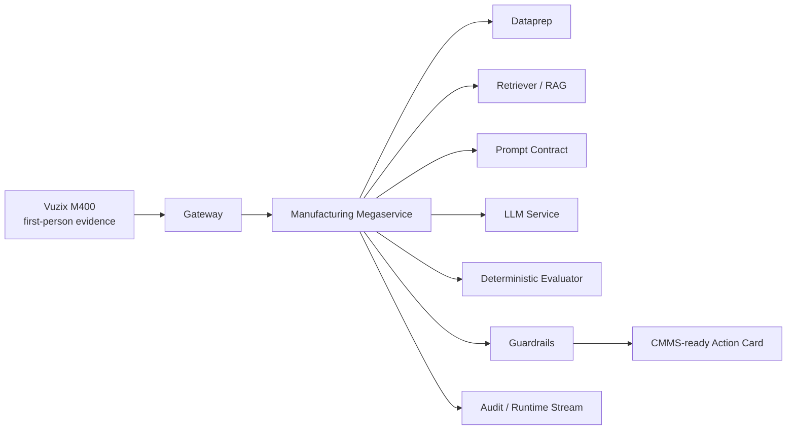

# OPEA Component Evidence

This document translates WearEdge Pro into the OPEA architecture expected by the challenge judges. The goal is to make the OPEA connection concrete while avoiding unsupported claims.

## Official OPEA References

| Reference | URL | How this submission uses it |
| --- | --- | --- |
| OPEA overview | https://opea-project.github.io/latest/introduction/index.html | Gateway, microservice, and megaservice architecture alignment |
| GenAI microservices | https://opea-project.github.io/latest/microservices/index.html | Microservice categories for LLM, RAG, guardrails, and orchestration |
| GenAIComps | https://github.com/opea-project/GenAIComps | Composable component reference |
| GenAIExamples | https://github.com/opea-project/GenAIExamples | Example application and deployment reference |

## Architecture

## Evidence Table

| OPEA layer | Status | WearEdge evidence | Claim |
| --- | --- | --- | --- |
| Gateway | Implemented in source | `jetson/app.py`, `scripts/run_fastapi.sh`, `docs/m400-inference-contract.md` | M400/Web/audit/session entry point |
| Megaservice | Implemented in source | `jetson/agently_orchestrator.py`, `jetson/agent_loop.py` | Manufacturing orchestration |
| Dataprep | Adapter-ready | `industrial-rag-agent/src/wear_edge_rag/documents.py` | SOP/log/quality-plan prep |
| Retriever / RAG | Implemented | `src/wear_edge_opea/retriever.py`, source `jetson/maintenance_kb.py` | Machine-specific maintenance retrieval |
| Vector DB | Implemented profile | `docker-compose.yml`, `src/wear_edge_opea/vector_store.py` | Qdrant profile with in-memory fallback |
| LLM Service | Adapter-ready | `src/wear_edge_opea/llm_stub.py`, source `jetson/llama_client.py` | Local deterministic no-model demo; source project has OpenAI-compatible edge LLM |
| Prompt Contract | Implemented in source | `jetson/output_contract.py` | Bounded Manufacturing fields and action starters |
| Guardrails | Implemented | `src/wear_edge_opea/guardrails.py`, source `jetson/agent_loop.py` | Source guard, uncertainty guard, human gate |
| Evaluation | Adapter-ready | `src/wear_edge_opea/evaluator.py`, source `docs/edge-runtime-benchmark.md` | Add GenAIEval-style scorecard next |
| Embeddings | Demo implemented | `src/wear_edge_opea/embedding.py` | Hashing embeddings for runnable profile; production embedding service next |

## Required OPEA Hardening

The current source project already contains an OPEA-shaped Manufacturing application. To make the challenge claim stronger, this standalone repository should add:

- Final challenge logs for `deploy.sh` and Docker Compose profile.
- OPEA-compatible wrappers around gateway, retrieval, LLM service, and evaluator.
- Production embedding model or OPEA embedding service.
- GenAIEval-style scorecard with latency, throughput, RAG quality, and action-card correctness.
- OPEA blueprint feedback issue or PR link.
