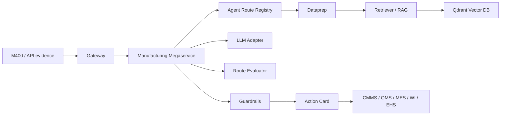

# OPEA Component Evidence

This document maps WearEdge Pro's five Manufacturing agents to the OPEA architecture expected by the challenge judges.

The judge-facing product entry point is the browser Manufacturing Demo Console:

```text
http://127.0.0.1:8088/demo
```

The M400 Android client is the real deployment front end and field-evidence source; the Web Console is the reproducible evaluation surface in this OPEA package.

## Official OPEA References

| Reference | URL | How this submission uses it |
| --- | --- | --- |
| OPEA overview | https://opea-project.github.io/latest/introduction/index.html | Gateway, microservice, and megaservice architecture alignment |
| GenAI microservices | https://opea-project.github.io/latest/microservices/index.html | Microservice categories for LLM, RAG, guardrails, and orchestration |
| GenAIComps | https://github.com/opea-project/GenAIComps | Composable component reference |
| GenAIExamples | https://github.com/opea-project/GenAIExamples | Example application and deployment reference |

## Architecture



## Five-Agent Coverage

| Mode | Knowledge source | Evaluator | Guarded target |
| --- | --- | --- | --- |
| `maintenance` | Gearbox KB and thresholds | vibration, temperature, lubrication, PLC alarm | `maintenance_work_order` |
| `iqc` | Aluminum housing quality plan | detector confidence and defect severity | `qms_quality_event` |
| `changeover` | SKU-C500 changeover checklist | line clearance, label, recipe, first-piece | `changeover_checklist` |
| `wi` | Cartoner released work instruction | identity, released revision, guard, alarm | `wi_reference` |
| `hazard` | PPE, moving-parts, walkway policy | active hazard flags | `ehs_case` |

## Evidence Table

| OPEA layer | Status | WearEdge evidence | Claim |
| --- | --- | --- | --- |
| Gateway | Implemented | `src/wear_edge_opea/gateway.py`, `Dockerfile`, `docker-compose.yml` | Five-agent FastAPI entry point |
| Web Demo Console | Implemented | `src/wear_edge_opea/demo_console.py` | Judge-facing browser product experience for five route demos |
| Megaservice | Implemented | `src/wear_edge_opea/megaservice.py` | Shared orchestration across five routes |
| Route registry | Implemented | `src/wear_edge_opea/agents.py` | Mode metadata, samples, KB paths, targets, guardrails |
| Dataprep | Implemented | `src/wear_edge_opea/dataprep.py`, `data/agent_kb/`, `data/maintenance_kb/` | Route-specific knowledge loading and chunking |
| Retriever / RAG | Implemented | `src/wear_edge_opea/retriever.py` | Route-specific retrieval before explanation |
| Vector DB | Implemented profile | `docker-compose.yml`, `src/wear_edge_opea/vector_store.py` | Qdrant collections per route, in-memory fallback |
| LLM Service | Adapter-ready | `src/wear_edge_opea/llm_stub.py`, source `jetson/llama_client.py` | Deterministic no-model demo, OpenAI-compatible source path |
| Guardrails | Implemented | `src/wear_edge_opea/guardrails.py` | Blocked claims and human gates per route |
| Evaluation | Implemented scorecard | `src/wear_edge_opea/evaluator.py`, `src/wear_edge_opea/scorecard.py` | Latency, contract, guardrail, RAG, target, isolation checks |

## Current Hardening Status

Implemented now:

- Five runnable agent demos.
- `/v1/agents`, `/v1/agents/{mode}/demo`, `/v1/agents/{mode}/infer`, and `/v1/scorecard`.
- Qdrant profile with route-specific collections.
- Route-isolation tests and scorecard tests.

Still required for maximum bonus:

- OPEA PR URL. Public RFC issue is posted at `https://github.com/opea-project/GenAIExamples/issues/2461`.
- Xeon AVX-512/AMX benchmark run. Harness and local smoke-test JSON are ready in `scripts/intel_cpu_benchmark.py` and `evidence/benchmarks/`.
- External 1-3 minute demo video URL. Article, script, and captions are ready in `public/`.
