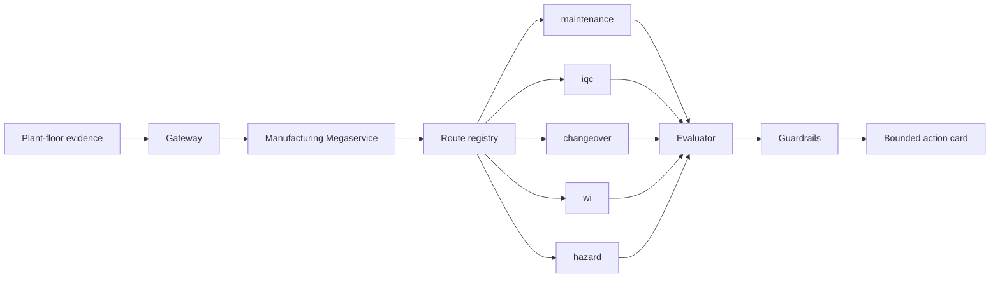

# ManufacturingAgentSuite Flow

OPEA component mapping:

| OPEA concept | ManufacturingAgentSuite role |
| --- | --- |
| Gateway | Plant evidence/API entry point |
| Megaservice | Route orchestration |
| Dataprep | Route-specific manuals, quality plans, policies, and checklists |
| Retriever/RAG | Source-grounded evidence retrieval in the full reference package |
| Vector DB | Qdrant profile in the full reference package |
| LLM service | Pluggable LLM adapter; deterministic path for CI |
| Guardrails | Blocked claims and human-confirmation gates |
| Evaluation | Route scorecard |
